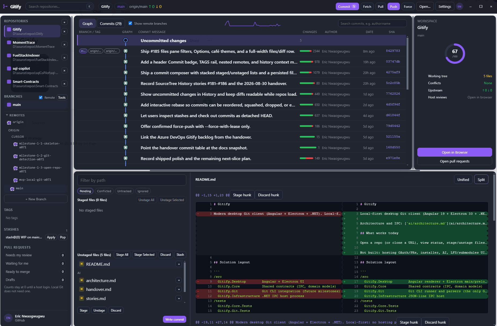
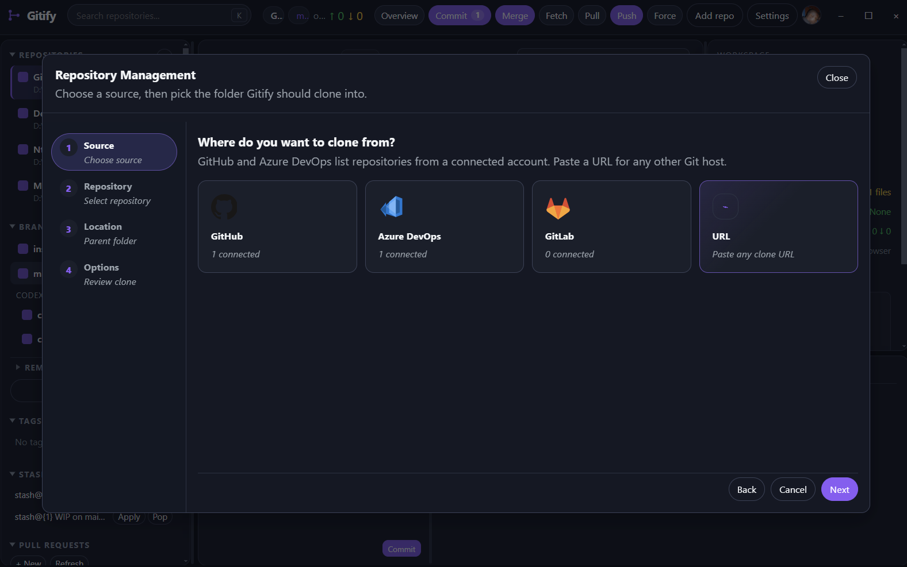
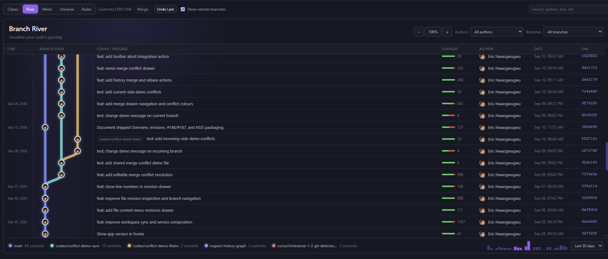

# Gitify downloads

This repository contains the packaged Gitify installers. The application source code is kept in a separate private repository.

## See Gitify in action

Gitify gives you a visual workspace for repositories, branches, commits, and connected hosting accounts.

### History



### Repository management



### Branch river



## Download Gitify

Open the [Releases page](https://github.com/nwaoga/gitify-downloads/releases) and choose the newest release. Prereleases are marked clearly; use one only if you want the latest testing build.

### Windows

- Most Windows PCs: download the `x64.exe` installer.
- Portable Windows copy: download the `x64.zip` archive.

### macOS

Check your Mac’s processor in **Apple menu → About This Mac**:

- Apple silicon (M1, M2, M3, M4, or newer): download the `arm64.dmg` installer or `arm64.zip` archive.
- Intel Mac: download the `x64.dmg` installer or `x64.zip` archive.

The `.dmg` file is the normal macOS installation option. Use the `.zip` archive if you prefer to copy the app manually.

### Linux

- Intel/AMD 64-bit Linux: download the `x86_64.AppImage` or `amd64.deb` package.
- ARM64 Linux: download the `arm64.AppImage` or `arm64.deb` package.

Use the `.deb` package on Debian, Ubuntu, or another Debian-based distribution. Use the AppImage on distributions where you prefer a self-contained executable.

## Files you can ignore

You normally do not need to download files ending in `.blockmap` or `latest*.yml`. They are used by Gitify’s automatic update system. The `Source code` archives are repository metadata, not application installers.

## First open / Gatekeeper & SmartScreen

This public build is unsigned. macOS and Windows may warn you the first time you open Gitify. The app is not damaged; the warning is because the build has no Apple or Microsoft signature.

### macOS

Gatekeeper may say Gitify is from an unidentified developer, or that it is damaged and should be moved to the Trash.

After you copy the app into the Applications folder, open Terminal and run:

```bash
xattr -cr /Applications/Gitify.app
```

If Gitify is not in Applications, use its actual path instead of `/Applications/Gitify.app`.

A lesser alternative is to right-click `Gitify.app` and choose **Open**, then confirm that you want to open it.

### Windows

If SmartScreen blocks the installer, choose **More info**, then **Run anyway**.

### If it still will not open

[Open an issue](https://github.com/nwaoga/gitify-downloads/issues) and include:

- your operating system and CPU architecture;
- the Gitify version; and
- a screenshot or log of the warning.

Do not include access tokens, private repository URLs, or other secrets.

## Help

For download or installation problems, [open an issue](https://github.com/nwaoga/gitify-downloads/issues) and include:

- your operating system and CPU architecture;
- the release version;
- the filename you downloaded; and
- the error message or a screenshot, without sharing private information.

Please do not post access tokens, private repository URLs, or other secrets in an issue.
